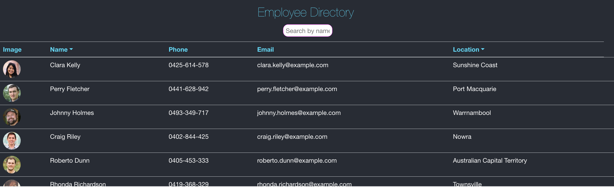
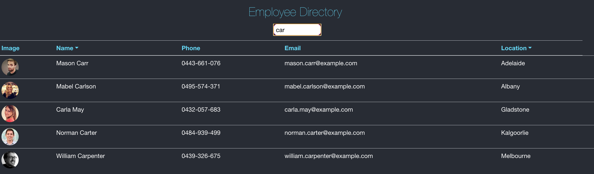

# React : Employee Directory

## Overview

A React application that allows managers to view information about their employees by generating an employee directory. 

---
| Table of Contents |
|---|
| [Description](#Description) |
| [Installation](#Installation) |
| [Usage](#Usage) |
| [License](#License) |
| [Contributing](#Contributing) |
| [Questions](#Questions) |
---

## Description

When presented with a table of employess users will be able search for a particular employee in addition to sorting employees  by name or location. 

Technologies utilised: React, Axios, Bootstrap

## Installation

Download the pacakge and run npm i in command line to install all dependencies. 

## Usage

Deployed application here:  https://karryns.github.io/Employee-Directory/

Application should appear as follows: 

 

 
## License 

## Contributing
To contribute please refer to https://github.com/microsoft/vscode/wiki/How-to-Contribute

## Questions
Please direct questions to the following email: karrynsaw@gmail.com

Github: https://github.com/KarrynS
